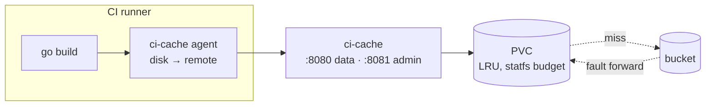

# ci-cache

One cache for every protocol CI uses: Go build outputs and modules today, and
the same volume and bucket in front of Maven, Gradle, Nix, npm and Bazel as
those front-ends land. One pod, one volume, one bucket, two ports.

Underneath is a single idea. A **tier** maps a key to bytes; a **chain** of
tiers is read front to back and written through, and a hit at the back is
faulted forward so the next read is answered closer. Everything else is a
front-end translating somebody's protocol into keys. That is why the same
binary is a server (`disk(PVC) → bucket`), a runner's agent
(`disk(emptyDir) → remote`) and a laptop's cache (`disk → bucket`).



## Credit

The idea is not ours. [`tailscale/go-cache-plugin`](https://github.com/tailscale/go-cache-plugin)
(BSD-3-Clause, read at commit `d651c79`) is where it comes from, and two
things are kept from it deliberately:

- **The tiering** — a local disk in front of an object store, faulted forward.
- **The `go/build` bucket key layout**, so that a bucket that plugin already
  warmed keeps answering through the switch. `frontends.go.build.legacyPrefix`
  exists for exactly that.

**No upstream code is copied.** This is a reimplementation, and
[0004](docs/decisions/0004-reimplementation-not-fork.md) says why a fork was
the wrong shape: upstream binds its server to loopback, its bucket is
mandatory, it is one protocol, and it has had no feature commit since June
2025.

## Quick start

The bucket is **any S3-compatible store**. AWS S3 and Cloudflare R2 are both
first-class, each with its own page; the difference between them is four
lines of values.

On **AWS S3**, where the role is on the ServiceAccount and there is nothing
to hold:

```yaml
# values.yaml
store:
  bucket: <bucket>
  region: <region>                                    # required: no lookup, ever

persistence:
  enabled: true
  size: 200Gi
  storageClass: <storage-class>

networkPolicy:
  enabled: true
  consumerNamespaces: [<namespace>]                   # empty admits nobody
```

```
helm upgrade --install ci-cache charts/ci-cache -n <namespace> -f values.yaml
```

EKS Pod Identity or IRSA carries the credential, so nothing above is a
secret. Give the role `GetObject`, `PutObject`, `DeleteObject` and
`ListBucket` on that bucket alone, put a lifecycle rule on it, and use a VPC
gateway endpoint — without one every fault-in leaves through NAT and is
billed per gigabyte, which is most of what this saves.
[AWS S3](docs/deploy/aws-s3.md) has all four in full.

On **Cloudflare R2**, the same install plus the three settings R2 needs *at
once* — and it is all three or none, which is why it has its own page:

```yaml
store:
  bucket: <bucket>
  region: auto                                        # R2 refuses a location lookup
  endpoint: https://<account>.r2.cloudflarestorage.com
  pathStyle: true                                     # the wildcard cert stops at the account
  existingSecret: ci-cache-r2                         # R2 has no pod identity
```

```
kubectl create secret generic ci-cache-r2 \
  --from-literal=AWS_ACCESS_KEY_ID=<access-key-id> \
  --from-literal=AWS_SECRET_ACCESS_KEY=<secret-access-key>
```

Setting `endpoint` also turns off the SDK's default checksums, which every
store but AWS rejects — [Cloudflare R2](docs/deploy/cloudflare-r2.md) has
that trap in full.

Then point a build at it:

```
GOPROXY=http://ci-cache:8080/go/mod|https://proxy.golang.org,direct
GOCACHEPROG=ci-cache agent --remote http://ci-cache:8080/go/build
```

The `|` matters: it falls through on *any* error, so an unreachable cache is a
slower build and not a failed one. [clients/go](docs/clients/go.md) is the
rest of the Go wiring, including what `ci-workflows` already sets.

## Two ports

`:8080` carries every front-end — HTTP, Connect and gRPC on one h2c listener,
split by path. `:8081` carries `Stats`, `List` and the three wipes, and
**never appears in a consumer NetworkPolicy**: on the data port every CI job
is a client, and a job that can wipe can empty the cache for everyone
([0003](docs/decisions/0003-two-ports.md)). The binary refuses to start with
the two ports equal.

## Status

| part | state |
|---|---|
| Tier and chain: fault-forward, single flight, write-through, write-behind | built |
| `/go/build` — the Go build cache over Connect, and the runner agent | first release |
| `/go/mod` — the module proxy and sumdb mirror | first release |
| Disk tier: LRU index seeded from mtime, `statfs` watermarks, per-front-end budgets | first release |
| Bucket tier on any S3-compatible store, checksum values and never algorithms | first release |
| Admin: `Stats`, `List`, `WipeDisk`, `WipeBucket`, `Invalidate` on `:8081` | first release |
| `/maven`, `/gradle/build`, `/gradle/dist`, `/nix`, `/npm`, `/bazel` | designed and configured for, not built |

## Documentation

| you want to | read |
|---|---|
| see how it fits together | [architecture](docs/architecture.md) |
| wire a build | [Go](docs/clients/go.md), [Maven](docs/clients/maven.md), [Gradle](docs/clients/gradle.md), [Nix](docs/clients/nix.md), [npm](docs/clients/npm.md), [Bazel](docs/clients/bazel.md) |
| install it | [AWS S3](docs/deploy/aws-s3.md), [Cloudflare R2](docs/deploy/cloudflare-r2.md) |
| run it | [operations](docs/operations.md) |
| measure it | [benchmarking](docs/benchmarking.md) |
| know why | [the decisions](docs/decisions/README.md) |

Everything starts at [docs/](docs/README.md).

## Licence

MIT. See [LICENSE](LICENSE).
