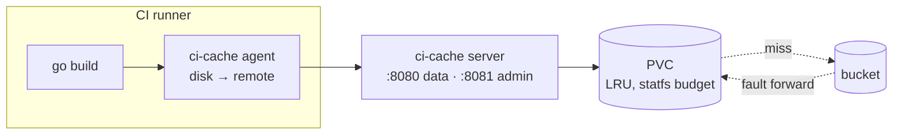

# ci-cache

Build caches for CI, as one released bundle: the **setup action** that looks
at a repository and wires its caches for a job, and a **cache server** — a
disk tier over an S3-compatible bucket, serving the Go build cache and the Go
module proxy — with its Helm chart. The action, the chart and the client
binaries are versioned together, so that a client is never pointed at a
service that left two releases ago.

| Artifact | What | Status |
|---|---|---|
| `setup/` (`truvity/ci-cache/setup`) | Composite action: detects `go.mod`, `devbox.json`/`flake.nix`, `yarn.lock`, `.moon/`, Gradle, and wires each cache for the job; fails open | shipped |
| `cmd/ci-cache` → `ghcr.io/truvity/ci-cache/server` | The server (`serve`), the runner agent (`agent`), the admin client (`admin`) | shipped |
| `charts/ci-cache-server` | The server as one Deployment, one volume, two Services, a NetworkPolicy | shipped |
| `go-cache-plugin_<version>_<os>_<arch>.tar.gz` | Upstream `tailscale/go-cache-plugin` v0.1.1, rebuilt unmodified, because upstream publishes no binaries | shipped |
| `ci-cache_<version>_nix-flake.tar.gz` | The server binary as a Nix flake, so a devbox can pin it by hash | shipped |

Every tag publishes the chart to `oci://ghcr.io/truvity/charts/ci-cache-server`
and the image to `ghcr.io/truvity/ci-cache/server`. Up to v0.2.0 they were
`charts/ci-cache` and `ci-cache/ci-cache`; the [CHANGELOG](CHANGELOG.md) says
why they moved and how to follow.

## Who it is for

A platform team running CI on its own runners and wanting its builds to stop
re-deriving what the last build already made. The setup action is for a CI
workflow shared across many repositories: it reads each repository's tree,
decides which caches apply, and degrades to the plain toolchain caches when a
backend is unreachable. The server is for a Kubernetes cluster that wants a
warm disk in front of a bucket for Go, with S3 or Cloudflare R2 behind it.

It deliberately does not create the bucket, the role or the Secret, and does
not decide which jobs get a cache: the caller's workflow keeps the *when*,
this repository owns the *how*.

## The model

A **tier** maps a key to bytes. A **chain** of tiers is read front to back and
written through, and a hit at the back is faulted forward so the next read is
answered closer. A **front-end** translates somebody's protocol into keys over
that chain. That is why the same binary is a server (`disk(PVC) → bucket`), a
runner's agent (`disk(emptyDir) → remote`) and a laptop's cache (`disk →
bucket`).


```mermaid
flowchart LR
  subgraph runner["CI runner"]
    GO["go build"] --> AG["ci-cache agent<br/>disk → remote"]
  end
  AG --> S["ci-cache server<br/>:8080 data · :8081 admin"]
  S --> D[("PVC<br/>LRU, statfs budget")]
  D -. miss .-> B[("bucket")]
  B -. fault forward .-> D
```

**Two ports.** `:8080` carries every front-end — HTTP, Connect and gRPC on one
h2c listener, split by path. `:8081` carries `Stats`, `List` and the three
wipes, and **never appears in a consumer NetworkPolicy**: on the data port
every CI job is a client, and a job that can wipe can empty the cache for
everyone ([0003](docs/decisions/0003-two-ports.md)). The binary refuses to
start with the two ports equal.

**Credit.** The idea is [`tailscale/go-cache-plugin`](https://github.com/tailscale/go-cache-plugin)'s
(BSD-3-Clause). The tiering and the `go/build` bucket key layout are kept on
purpose, so a bucket that plugin warmed keeps answering through a switch
(`frontends.go.build.legacyPrefix`). The server is a reimplementation, not a
fork — [0004](docs/decisions/0004-reimplementation-not-fork.md) says why. The
only upstream code in the tree is `third_party/go-cache-plugin`, its `cmd/`
copied byte-for-byte so the release can build the unmodified binary.

## Install and a worked example

**The setup action** is nested: a shared CI workflow calls it, and the
repositories that use that workflow never name it.

```yaml
- uses: truvity/ci-cache/setup@<sha>   # vX.Y.Z
  with:
    bucket: ${{ vars.CI_CACHE_BUCKET }}  # the caller's own; never in this repo
    region: ${{ vars.CI_CACHE_REGION }}
```

With a bucket, the Go build cache goes through `go-cache-plugin` straight to
it. If the plugin cannot get credentials for the bucket, it gives up on it
within seconds and the build carries on locally. Without a bucket, the job
gets the plain toolchain caches and a warning.
[docs/setup-action.md](docs/setup-action.md) has every input and what each
detected build system gets.

**The server**, on AWS S3 with pod identity:

```yaml
# values.yaml
store:
  bucket: <bucket>
  region: <region>                    # required: the SDK never guesses

serviceAccount:
  annotations:
    eks.amazonaws.com/role-arn: "arn:aws:iam::<account>:role/<role>"

persistence:
  size: 200Gi
  storageClass: <storage-class>

networkPolicy:
  consumerNamespaces: [<namespace>]   # empty admits nobody
```

```sh
helm upgrade --install ci-cache oci://ghcr.io/truvity/charts/ci-cache-server \
  --version <version> -n <namespace> -f values.yaml
```

`ci-cache-server` is published from the first release after v0.2.0; pin that
release or a later one. The role needs `GetObject`, `PutObject`,
`DeleteObject` and `ListBucket` on that bucket alone; give the bucket a
lifecycle rule and the VPC an S3 gateway endpoint, or every fault-in is billed
through NAT. [AWS S3](docs/deploy/aws-s3.md) has all of it.

On **Cloudflare R2** three settings change at once — `region: auto`, an
`endpoint`, `pathStyle: true` — and the keys come from a Secret, because R2
has no pod identity. [Cloudflare R2](docs/deploy/cloudflare-r2.md) says why
all three and what it looks like when one is missing.

Then point a build at it, through the Service the release made:

```sh
GOCACHEPROG='ci-cache agent --remote http://ci-cache.<namespace>:8080/go/build'
GOPROXY='http://ci-cache.<namespace>:8080/go/mod|https://proxy.golang.org,direct'
```

The agent fails open: an unreachable server is a slower build, not a failed
one. [clients/go](docs/clients/go.md) is the rest of the Go wiring, including
what the separator in `GOPROXY` trades.

## Consumers

- **truvity/ci-actions** — the `setup` action, called from its
  `setup-devbox` action. Through it, every repository whose CI runs the
  shared `truvity/ci-workflows` check gets its caches wired by this
  repository.
- **The server, chart and agent** have no production installation at HEAD.
  The maintainers ran the server and took it out of their Go path after
  measuring it: it reached parity with `go-cache-plugin` over the bucket in
  its own best case and lost to it in CI, and a build's fetch rate is set by
  its own parallelism rather than by anything a cache does. The comment on
  the Go step in [setup/action.yaml](setup/action.yaml) records it.

## Neighbours

- **[truvity/ci-workflows](https://github.com/truvity/ci-workflows)** is the
  only thing a caller pins; **[truvity/ci-actions](https://github.com/truvity/ci-actions)**
  holds the composite steps and calls this repository's `setup`; this
  repository owns cache wiring and the cache server;
  **[truvity/ci-plane](https://github.com/truvity/ci-plane)** is where work
  executes — the runner and nix-worker images, and the `arc-runners` and
  `ci-builders` charts. `ci-builders` still carries the in-cluster Nix, npm
  and Bazel caches; moving them to this repository is tracked separately.
- **[truvity/policy](https://github.com/truvity/policy)** holds the
  [component contract](https://github.com/truvity/policy/blob/master/docs/contracts/component.md)
  this repository is held to.

## Documentation

| you want to | read |
|---|---|
| see how it fits together | [architecture](docs/architecture.md) |
| wire a repository's CI | [the setup action](docs/setup-action.md) |
| wire a build by hand | [Go](docs/clients/go.md); the other front-ends' pages are designs, not yet code |
| install the server | [AWS S3](docs/deploy/aws-s3.md), [Cloudflare R2](docs/deploy/cloudflare-r2.md) |
| run it | [operations](docs/operations.md) |
| measure it | [benchmarking](docs/benchmarking.md), [baselines](docs/bench/README.md) |
| know why | [the decisions](docs/decisions/README.md) |
| see what changed | [CHANGELOG](CHANGELOG.md) |

Everything starts at [docs/](docs/README.md).

## The rule that makes this repository public

**Mechanism only.** Nothing here names a bucket, an account, a cluster, a
namespace or a hostname; each is an input, and the consuming estate supplies
it from its own repository. The chart has no default bucket or region and
refuses to render without them. `hack/leak-canary.sh` enforces the rule in
`just check`, because public history cannot be unpublished.

This repository follows the shared
[component contract](https://github.com/truvity/policy/blob/master/docs/contracts/component.md).

## Status

| part | state |
|---|---|
| Setup action: detection, Go build cache via `go-cache-plugin` to the bucket, fail-open | released, in use |
| `go-cache-plugin` archives (`client-version`) | released |
| Tier and chain: fault-forward, single flight, write-through, write-behind | released |
| `/go/build` — the Go build cache over Connect, and the runner agent | released, not in production use |
| `/go/mod` — the module proxy and sumdb mirror | released, not in production use |
| Disk tier: LRU index seeded from mtime, `statfs` watermarks, per-front-end budgets | released |
| Bucket tier on any S3-compatible store | released |
| Admin: `Stats`, `List`, `WipeDisk`, `WipeBucket`, `Invalidate` on `:8081` | released |
| `/maven`, `/gradle/build`, `/gradle/dist`, `/nix`, `/npm`, `/bazel` | configured for, not built |

Releases are listed on the
[releases page](https://github.com/truvity/ci-cache/releases).

## Development

```sh
devbox shell   # or direnv
just check     # build, test, lint, proto, drift, chart, docs, vuln, leak-canary, setup-action, vendored
just race      # the suite under the race detector; needs a C toolchain, so not in check
just chart     # goldens + refusals only
```

`just chart` renders every `tests/cases/ci-cache-server/<case>/values.yaml`
and compares it with `tests/golden/ci-cache-server/<case>.yaml`, and
`tests/refuse.sh` proves each configuration the chart must refuse — the
template's own rules and every schema fixture under
`tests/invalid/ci-cache-server/`. `just bench` loads a running server and is
never part of `check`. [CONTRIBUTING](CONTRIBUTING.md) has the rest.

## Releasing

Push a tag `vX.Y.Z` after its `## vX.Y.Z` heading lands in the CHANGELOG. The
shared release workflow builds the archives and the image with goreleaser and
ko, publishes the Nix flake, and pushes the chart with its `version` and
`appVersion` stamped from the tag — `Chart.yaml` commits `0.0.0` for both, and
the image tag defaults to `appVersion`. There is no auto-release: every
release is a manual tag.

## Licence

MIT — see [LICENSE](LICENSE). `third_party/go-cache-plugin` is BSD-3-Clause,
and its licence travels inside every `go-cache-plugin` archive.
