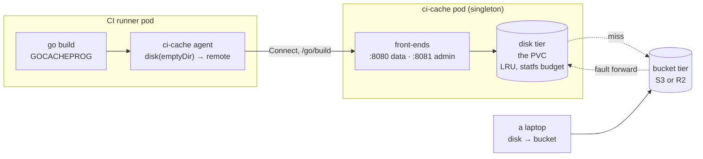
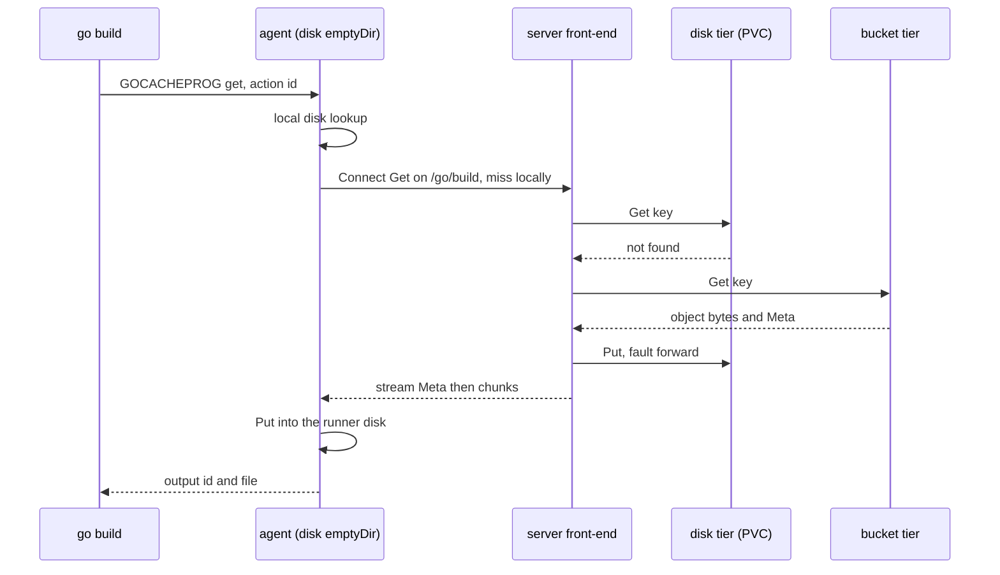

# Architecture

One cache for every protocol CI uses. One pod, one volume, one bucket, two
ports.

Everything below rests on a single abstraction: a **tier** is a place that
maps a key to bytes. A **chain** of tiers is read front to back and written
through, and a hit at the back is faulted forward so that the next read is
answered closer. Every front-end — the Go build cache, the module proxy, the
Maven proxy, the rest — is nothing but a translation from somebody's protocol
into keys over that chain. That is why three quite different deployments are
the same binary rather than three programs that happen to look alike.

[The decisions](decisions/README.md) say why the shape is this one. The
[client pages](README.md#clients) say what to put in each tool's
configuration, and the [deploy pages](deploy/aws-s3.md) say what to put in
the chart.

## The chain

A tier answers four questions — `Get`, `Put`, `Stat`, `Delete` — and says its
own name for metrics and logs. It speaks three errors that the chain depends
on: `ErrNotFound` for a miss, which is the ordinary case and is not logged
above debug; `ErrExists` for an immutable key that is already present, which
racing writers of the same content-addressed object treat as success; and
`ErrNoSpace`, which says the cache is full rather than broken, so a caller may
carry on without caching.

Two capabilities are optional and only some tiers have them. `DeletePrefix`
removes everything under a prefix in one call, and the bucket implements it
because deleting ten thousand objects one request at a time is the difference
between a wipe that finishes and one that is still running when somebody gives
up on it. `List` enumerates, and only the disk tier implements it: listing a
bucket costs money and time, and the admin API's `List` exists to answer "what
is on the volume", which is a question about the disk.

Besides its bytes, a tier keeps four things about an object. `Size`, which on
a `Put` may be zero when the caller does not yet know it — the tier records
what it actually stored. `ModTime`, which is when whatever produced the object
made it and **not** when it was cached: the Go toolchain compares the
modification time of an output, so faulting an object from one tier to another
has to carry it across or the toolchain will disbelieve the answer.
`ContentType`, served back by the HTTP front-ends and empty for opaque bytes.
And `Immutable`, which makes a second `Put` return `ErrExists` instead of
overwriting — that is what lets a content-addressed key be trusted once it has
been read.

### Three deployments, one chain

| deployment | chain | why that order |
|---|---|---|
| server | `disk(PVC) → bucket` | the PVC absorbs the repeated reads; the bucket survives the pod |
| a runner's agent | `disk(emptyDir) → remote` | the runner's own disk answers a re-run of the same job without a network hop |
| a laptop | `disk → bucket` | no cluster in the path, and the same binary |

`remote` is this service seen from a runner: the `cache.v1.Cache` service,
which is one tier of the chain reachable over the network.

### What the chain adds over a loop

- **Fault-forward.** On a hit at tier *i*, the bytes are streamed to the
  caller and written into every tier in front of *i*, nearest-last, so that a
  reader racing the fault never sees a front tier holding the object while a
  middle one does not. A failed fault costs the next reader a slower answer
  and nothing else.
- **Single flight.** Concurrent misses on one key collapse into a single read
  of the tier behind. Without it, sixty-four parallel compile actions that all
  miss locally become sixty-four downloads of the same object. The frontmost
  tier is read outside the group, because a local hit is the common case and
  must not queue behind anything.
- **A memory ceiling that is ours.** A fault of at most 8 MiB is held in
  memory; anything larger, or of unknown length, spills to a temp file which
  is unlinked as soon as it is reopened. Otherwise the cache's memory would be
  decided by whatever is being built.
- **Write-through with a known outcome.** The *first* tier decides what the
  caller is told: it is the one the caller reads from next, and the one whose
  failure means the cache did not work. Tiers behind it are best-effort,
  inline or through the write-behind queue. A full queue drops that tier's
  copy, which is a cache miss later and never an error now.
- **A broken front tier is not fatal.** A `Get` whose front tier errors keeps
  looking behind it. A cache that fails closed on a bad disk is worse than one
  that is slow.

## The request path

Every message on that path streams. A cached object is anything from a few
bytes to hundreds of megabytes, and a protocol that buffered whole objects
would hand the cache's memory ceiling to whatever is being built. On the wire
that is a `Get` whose first message carries `Meta` and no bytes and whose
every later message carries bytes and no metadata, and a `Put` that mirrors
it: header first, then chunks, with the response reporting the size the server
actually stored, which is authoritative.

The Connect codes carry the chain's errors across the network: `NotFound` for
an absent key on `Get` (`Stat` answers `exists=false` instead, because a miss
costs a client nothing to handle and is not an error), `AlreadyExists` for an
immutable key already present, `ResourceExhausted` when the server cannot make
room, and `Unavailable` when the server is over its concurrency limit.

## The data port

`:8080` is one listener carrying plain HTTP, Connect and gRPC together, split
by path. One port is what lets a NetworkPolicy be written once and a runner be
given one address.

There is no h2c wrapper in the import list, which surprises people who have
built this before: `net/http` accepts unencrypted HTTP/2 itself from Go 1.24
on, by sniffing the client's connection preface before it commits to
HTTP/1.1. The listener is h2c in effect, and it is the standard library's.

| path | front-end | client setting | first release |
|---|---|---|---|
| `/go/build` | Go build cache, Connect `cache.v1.Cache` | the agent's `--remote` | ships |
| `/go/mod` (and `/go/mod/sumdb/…`) | Go module proxy and sumdb mirror | `GOPROXY` | ships |
| `/maven/<name>` | one Maven repository proxy per configured upstream | the repository URL in Gradle or Maven | planned |
| `/gradle/build` | Gradle remote HTTP build cache | `buildCache.remote(HttpBuildCache)` | planned |
| `/gradle/dist` | allow-listed Gradle wrapper distributions | `distributionUrl` | planned |
| `/nix` | nix binary cache origin | `substituters` | planned |
| `/npm` | npm registry proxy | `registry` | planned |
| `/bazel` | Bazel remote execution API v2, cache half, gRPC | the build tool's remote host | planned |
| `/healthz`, `/readyz` | liveness and readiness | — | ships |

**Only `/go/build` and `/go/mod` ship in the first release.** The others are
designed, their configuration exists in the schema, and they are written up on
the [client pages](README.md#clients) so that the shape is agreed before the
code lands — but they are not running anywhere yet, and a page that describes
one says so at the top.

## The admin port

`:8081` carries `Stats`, `List`, `WipeDisk`, `WipeBucket` and `Invalidate`.
**It is never in a consumer NetworkPolicy.** On the data port every CI job is
a client, and a job that can wipe can empty or poison the cache for everyone;
the port is the boundary, not a path prefix or a token
([0003](decisions/0003-two-ports.md)). The binary refuses to start if the two
ports are equal, because a shared port would make that boundary a matter of
routing.

The three wipes are separate calls on purpose. Clearing a prefix from disk
costs a re-download; clearing it from the bucket is the real reset, and it must
not be reachable by one wrong argument to the other. `WipeBucket` takes a
prefix only and refuses `""` and `"/"`, and it deletes the matching disk
entries too — keeping a disk copy of what the bucket no longer has would make
the next read lie. What each one is for is in [operations](operations.md).

`Stats` answers per front-end and per tier, plus the disk's used and budgeted
bytes, the upload queue depth, and `index_cold`, which is true while the disk
index is still being rebuilt from the filesystem. The cache serves throughout
that rebuild; only its counters are incomplete.

## The disk tier

The disk tier owns the volume and keeps an in-memory LRU index of it, seeded
from each file's modification time at start-up. It is seeded from mtime
because `atime` cannot be trusted: `relatime` and `noatime` are both common,
and a cache that evicted by an access time the filesystem never updated would
evict the hottest objects first.

Garbage collection is bounded by `statfs` rather than by a configured size.
`gc.floor` is the fraction of the filesystem to leave free; the budget is
what remains. `gc.high` and `gc.low` are percentages of that budget: eviction
starts when usage crosses the high watermark and runs until it is back under
the low one, so the cache is not re-entering GC on every write. **Resizing the
PVC therefore needs no other change** — the budget follows the filesystem.
`gc.budgetBytes` overrides the derived budget for a volume shared with
something else, and `gc.budgets` caps one front-end as a percentage of the
whole, so a front-end over its cap is evicted before anything else.

## The bucket tier

The bucket is any store that speaks the S3 API. Three of its settings exist
because stores disagree about details that are invisible until they are not:

- **`store.region` is required.** The SDK's own resolution inside a pod is
  whatever the environment happens to carry, and Cloudflare R2 rejects a
  bucket-location lookup outright — it answers to `auto`.
- **Setting `store.endpoint` also turns off the SDK's default request and
  response checksums**, which stores other than AWS reject.
- **`store.pathStyle` is its own switch** because it is a property of the
  store's certificate — does its wildcard cover a bucket subdomain? — and not
  of the endpoint.

The tier sends checksum **values** and never checksum **algorithms**. Naming
an algorithm together with a `Content-Encoding` makes the AWS SDK switch to
the `aws-chunked` trailer encoding, and Cloudflare R2 answers that with
`403 SignatureDoesNotMatch` (measured 2026-09-23). The failure looks like a
credentials problem and is not one, which is why it is written down here and
not only in a comment.

Writes to the bucket go through a write-behind queue: `upload.concurrency`
workers, bounded by `upload.queue` objects and `upload.queueBytes` bytes, and
`upload.minSize` skips the bucket entirely for objects below it, because a
round trip per hundred-byte object costs more than re-deriving it.

## The agent is fail-open

`GOCACHEPROG` is not a cache the toolchain can shrug off: if the program is
unreachable or answers badly, the build **fails**, rather than proceeding
slowly. So the agent treats every remote error as a miss and every remote
write failure as a write that did not happen. A cache outage must cost CI
time and never a red build.

That is the same instinct as every other front-end's fallback: `GOPROXY` ends
in `direct`, Nix lists `cache.nixos.org` after this cache, Gradle's remote
cache is an optimisation over its local one. Each client page names its
fallback explicitly.

## One pod, on purpose

The deployment is a singleton: `Recreate` strategy, one replica, one
ReadWriteOnce PVC. Two replicas behind one Service would each hold half the
answers, halve the hit rate, and double the bucket traffic, and RWO makes the
second pod fail to schedule rather than quietly do that. A rollout is
therefore a short outage of the cache — which is exactly the case every client
already has a fallback for. [Operations](operations.md) has the drain and
restart.

The disk tier being a single writer is also what makes the index and its LRU
cheap: they are in one process's memory, not a shared structure behind a lock
held over the network.

## Configuration

`config.Config` is the one schema. The same shape is a YAML file, a set of
flags, a set of environment variables (`CI_CACHE_<SECTION>_<NAME>`, upper
snake case) and the shape the chart's values take. One schema means the chart,
the CLI and the deploy pages cannot describe different things, which they
will, the moment there are two.

| section | what it decides |
|---|---|
| `store` | the bucket, its region, endpoint, addressing and key prefix |
| `frontends` | which protocols this installation serves, and each one's upstream and TTLs |
| `persistence` | the disk tier's directory, and `ephemeralIsAcceptable` |
| `gc` | the watermarks and the per-front-end budgets |
| `upload` | the write-behind queue |
| `service` | the two ports |
| `server` | `concurrency` and `drainTimeout` |
| `telemetry` | the OTLP endpoint and the trace sampling ratio |
| `logLevel` | how much is said |

`Validate` refuses a configuration that would deploy and then misbehave, and
each rule is also refused by the chart at render time. Two gates for one rule
is not duplication: the chart catches it before a cluster sees it, and the
binary catches it when somebody runs it by hand. The rules are that the bucket
and region are required, that an endpoint must be an absolute URL, that
`gc.low` is below `gc.high` and `gc.floor` is at most 90, that the two ports
differ, that a Maven front-end has at least one upstream and each is absolute,
that a Nix front-end has at least one upstream, and that
`gradle.dist` has an allow list — a distribution proxy with no allow list is
an open relay.

One rule deserves its own sentence. If the build cache is on and
`persistence.dir` looks like an `emptyDir` (`/tmp`, `/var/tmp`, `/dev/shm`),
start-up is refused unless `persistence.ephemeralIsAcceptable` says that is
intended. The check is a heuristic and says so — nothing inside the pod can
prove a filesystem's lifetime — but the shape it catches is the one that looks
like a cache and keeps nothing, which is what this whole service exists to
stop. The agent, whose disk tier genuinely is an `emptyDir`, sets the flag.
